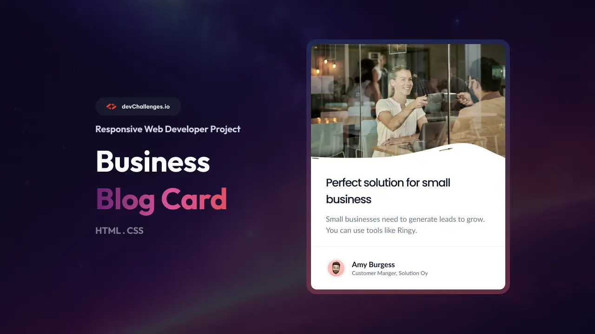

# Mini Responsive Blog Card

This is a solution to the [Business Blog Card](https://devchallenges.io/challenge/business-blog-card) challenge on [devChallenges](https://devchallenges.io/). This challenge is a great way to practice basic HTML and CSS skills. The challenge is to create a business blog card that challenges you to use flexbox, positioning,...

## Demo

Live Site URL: [Link to live site](https://webien.github.io/webdev-projects/responsive-business-blog-card/)
