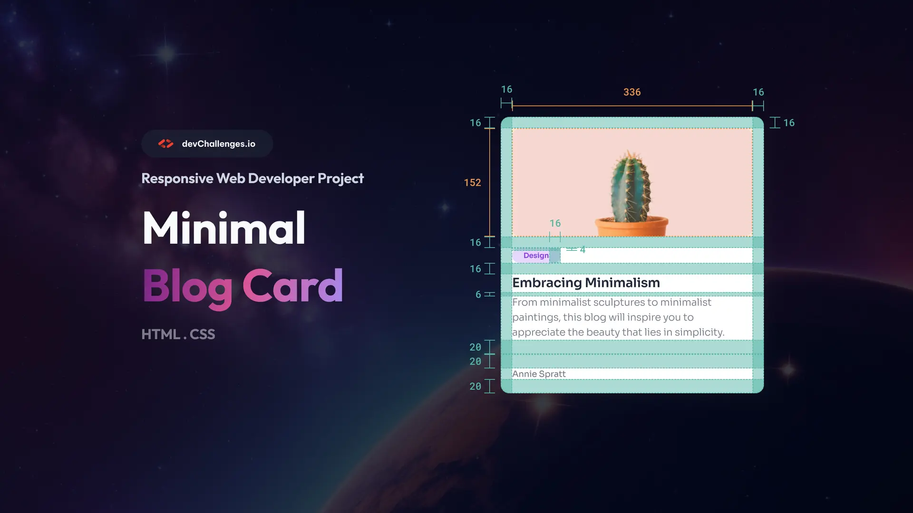

# Mini Responsive Blog Card

This is a solution to the [Minimal Blog Card](https://devchallenges.io/challenge/minimal-blog-card) challenge on [devChallenges](https://devchallenges.io/). This challenge is a great way to start with basic HTML and CSS skills. The challenge is to create a simple blog card that includes an image, a title, a short description, and a tag.

## Demo

Live Site URL: [Link to live site](https://webien.github.io/webdev-projects/responsive-mini-blog-card/)

 
